<p align="center">
  <a href="README_en.md">English</a> | <a href="README.md">中文</a>
</p>

<p align="center">
  
  <br>
  <strong>Claude Skill 安全审计工具</strong>
  <br>
  <em>在安装第三方 Skill 之前检测恶意模式</em>
</p>

<p align="center">
  <a href="https://pypi.org/project/claude-skill-auditor/"></a>
  <a href="https://pypi.org/project/claude-skill-auditor/"></a>
  <a href="https://github.com/awch-D/claude-skill-auditor/actions"></a>
  <a href="https://opensource.org/licenses/MIT"></a>
</p>

<p align="center">
  <a href="#安装">安装</a> •
  <a href="#快速开始">快速开始</a> •
  <a href="#功能特性">功能特性</a> •
  <a href="#ci-集成">CI 集成</a> •
  <a href="#自定义规则">自定义规则</a> •
  <a href="docs/ARCHITECTURE.md">架构文档</a>
</p>

---

## 系统架构

> 📐 **[查看完整架构文档 →](docs/ARCHITECTURE.md)**

```mermaid
%%{init: {'theme': 'dark', 'themeVariables': { 'primaryColor': '#000000', 'primaryTextColor': '#ffffff', 'primaryBorderColor': '#ffffff', 'lineColor': '#ffffff', 'secondaryColor': '#1a1a1a', 'background': '#000000', 'nodeBorder': '#ffffff', 'clusterBkg': '#1a1a1a', 'clusterBorder': '#ffffff'}}}%%
flowchart LR
    subgraph INPUT["📥 输入"]
        A["Skill 文件"]
    end
    subgraph PROCESS["⚙️ 处理"]
        B["解析器"] --> C["规则引擎"] --> D["分析器"]
    end
    subgraph OUTPUT["📤 输出"]
        E["报告"]
    end
    A --> B
    D --> E
```



---

## 为什么使用？

第三方 Claude Skill 可能包含**隐藏的恶意指令**：
- 🎭 通过 prompt 注入覆盖系统提示
- 📤 将敏感数据泄露到外部服务器
- 💻 执行危险的 shell 命令
- 🔑 访问凭证和环境变量

**claude-skill-auditor** 在安装 Skill 之前扫描文件，检测 7 大风险类别中的 21+ 种攻击模式。

---

## 安装

```bash
pip install claude-skill-auditor
```

<details>
<summary><strong>其他安装方式</strong></summary>

### 使用 pipx（隔离环境）
```bash
pipx install claude-skill-auditor
```

### 从源码安装
```bash
git clone https://github.com/awch-D/claude-skill-auditor.git
cd claude-skill-auditor
pip install -e .
```

</details>

验证安装：
```bash
skill-auditor --version
```

---

## 快速开始

### 扫描已安装的 Claude Skills

```bash
# 自动扫描所有 Claude Skill 位置
skill-auditor scan-all

# 扫描个人全局技能 (~/.claude/skills/)
skill-auditor scan --global

# 扫描项目本地技能 (./.claude/skills/)
skill-auditor scan --project

# 显示当前系统的 Claude Skill 路径
skill-auditor paths
```

### 审计单个 Skill 文件

```bash
skill-auditor audit ./path/to/SKILL.md
```

**输出示例：**

```
╭─────────────────────────────────────────────────────────────╮
│                   Skill 安全审计报告                         │
╰─────────────────────────────────────────────────────────────╯

文件: suspicious-skill.md
风险评分: 85/100

┏━━━━━━━━━━┳━━━━━━━━━━━━━━━━━━━━━━━━━━━━━━━━━━━━━━━━━━━━━━━━━┓
┃ 严重级别  ┃ 发现问题                                         ┃
┡━━━━━━━━━━╇━━━━━━━━━━━━━━━━━━━━━━━━━━━━━━━━━━━━━━━━━━━━━━━━━┩
│ 严重     │ [PI-001] 检测到忽略之前指令的模式                  │
│ 严重     │ [DE-001] 发现外部 webhook URL                     │
│ 高危     │ [CI-001] 危险的 rm -rf 命令                       │
└──────────┴─────────────────────────────────────────────────┘

建议: 请勿安装此 Skill
```

### 扫描目录

```bash
# 扫描文件夹中的所有 skill
skill-auditor scan ./skills/

# 递归扫描并生成报告
skill-auditor scan ./skills/ -r -o ./reports/
```

### 输出格式

```bash
# JSON（用于自动化）
skill-auditor audit ./SKILL.md -f json

# SARIF（用于 GitHub Code Scanning）
skill-auditor audit ./SKILL.md -f sarif -o results.sarif

# Markdown（人工阅读）
skill-auditor audit ./SKILL.md -f markdown
```

---

## 功能特性

| 类别 | 检测内容 | 严重级别 |
|------|----------|----------|
| **Prompt 注入** | 忽略指令、角色操纵、隐藏命令 | 严重 |
| **数据泄露** | Webhook、外部 API、批量数据收集 | 严重 |
| **命令注入** | rm -rf、curl 管道、包管理器滥用 | 严重 |
| **凭证暴露** | 环境变量、API 密钥、硬编码密钥 | 严重 |
| **权限滥用** | 无限制工具、危险工具组合 | 高危 |
| **路径遍历** | ~/.ssh、/etc/passwd、敏感目录 | 高危 |
| **社会工程** | 紧迫感操纵、权威冒充 | 中危 |

**21+ 条内置规则**，基于真实攻击模式。

---

## CI 集成

### GitHub Actions

```yaml
name: Skill 安全审计

on: [push, pull_request]

jobs:
  audit:
    runs-on: ubuntu-latest
    steps:
      - uses: actions/checkout@v4

      - name: 设置 Python
        uses: actions/setup-python@v5
        with:
          python-version: '3.11'

      - name: 安装审计工具
        run: pip install claude-skill-auditor

      - name: 审计 skills
        run: skill-auditor scan ./skills/ -r --fail-on high

      - name: 上传 SARIF
        if: always()
        uses: github/codeql-action/upload-sarif@v3
        with:
          sarif_file: results.sarif
```

### 失败阈值

```bash
# 高危及以上时阻断（默认）
skill-auditor audit ./SKILL.md --fail-on high

# 仅严重级别时阻断
skill-auditor audit ./SKILL.md --fail-on critical

# 仅报告，不阻断
skill-auditor audit ./SKILL.md --fail-on none
```

---

## 自定义规则

使用 YAML 创建自定义规则：

```yaml
# my-rules/internal.yaml
rule_set:
  id: "internal-rules"
  name: "内部安全规则"
  version: "1.0.0"

rules:
  - id: "INT-001"
    name: "内部 API 引用"
    severity: high
    category: data_exfiltration
    description: "Skill 引用了内部 API 端点"
    patterns:
      - "(?i)https?://internal\\."
      - "(?i)https?://.*\\.internal\\."
    recommendation: "发布前移除内部 API 引用"
```

使用自定义规则：

```bash
skill-auditor audit ./SKILL.md --rules-dir ./my-rules/
```

---

## 命令参考

<details>
<summary><strong>skill-auditor scan-all</strong></summary>

```
用法: skill-auditor scan-all [选项]

  自动扫描所有 Claude Skill 位置。
  发现并扫描以下位置的技能:
    - 个人全局: ~/.claude/skills/
    - 项目本地: ./.claude/skills/

选项:
  -o, --output PATH               报告输出目录
  -f, --format [json|markdown|sarif]
                                  输出格式（默认: json）
  --help                          显示帮助信息
```

</details>

<details>
<summary><strong>skill-auditor scan</strong></summary>

```
用法: skill-auditor scan [选项] [目录]

  扫描目录中的多个 Skill 文件。

选项:
  -r, --recursive                 递归扫描（默认: 是）
  -o, --output PATH               报告输出目录
  -f, --format [json|markdown|sarif]
                                  输出格式（默认: json）
  -g, --global                    扫描个人全局技能 (~/.claude/skills/)
  -p, --project                   扫描项目本地技能 (./.claude/skills/)
  --help                          显示帮助信息
```

</details>

<details>
<summary><strong>skill-auditor audit</strong></summary>

```
用法: skill-auditor audit [选项] SKILL_PATH

  审计单个 Skill 文件的安全风险。

选项:
  -f, --format [json|markdown|sarif]  输出格式（默认: markdown）
  -o, --output PATH                   保存报告到文件
  -s, --severity [low|medium|high|critical]
                                      报告的最低严重级别
  --fail-on [none|medium|high|critical]
                                      达到级别时返回退出码 1
  --rules-dir PATH                    自定义规则目录
  -v, --verbose                       详细输出
  --help                              显示帮助信息
```

</details>

<details>
<summary><strong>skill-auditor paths</strong></summary>

```
用法: skill-auditor paths [选项]

  显示当前系统的 Claude Skill 路径。
  显示 Claude Skills 存储的标准位置。

选项:
  --help  显示帮助信息
```

</details>

<details>
<summary><strong>skill-auditor init</strong></summary>

```
用法: skill-auditor init [选项]

  创建配置文件。

选项:
  -o, --output PATH  输出文件（默认: skill-audit-config.yaml）
  --help             显示帮助信息
```

</details>

---

## 退出码

| 代码 | 含义 |
|------|------|
| `0` | 审计通过（无达到阈值的问题） |
| `1` | 审计失败（发现达到 `--fail-on` 级别的问题） |

---

## 环境要求

- Python 3.9+
- 支持 **Windows**、**macOS** 和 **Linux**
- 仅 3 个依赖: `click`, `pyyaml`, `rich`

---

## 卸载

```bash
pip uninstall claude-skill-auditor
```

---

## 贡献

欢迎贡献！请参阅 [CONTRIBUTING.md](CONTRIBUTING.md) 了解指南。

---

## 许可证

[MIT 许可证](LICENSE) - Claude Skill Auditor Team

---

<p align="center">
  <sub>为 Claude 生态系统安全而构建</sub>
</p>
