<p align="center">
  <a href="README.md">English</a> | <a href="README_zh.md">中文</a>
</p>

<p align="center">
  
  <br>
  <strong>Security auditing tool for Claude Skills</strong>
  <br>
  <em>Detect malicious patterns before installing third-party skills</em>
</p>

<p align="center">
  <a href="https://pypi.org/project/claude-skill-auditor/"></a>
  <a href="https://pypi.org/project/claude-skill-auditor/"></a>
  <a href="https://github.com/awch-D/claude-skill-auditor/actions"></a>
  <a href="https://opensource.org/licenses/MIT"></a>
</p>

<p align="center">
  <a href="#installation">Installation</a> •
  <a href="#quick-start">Quick Start</a> •
  <a href="#features">Features</a> •
  <a href="#ci-integration">CI Integration</a> •
  <a href="#custom-rules">Custom Rules</a> •
  <a href="docs/ARCHITECTURE.md">Architecture</a>
</p>

---

## System Architecture

> 📐 **[View Full Architecture Documentation →](docs/ARCHITECTURE.md)**

```mermaid
%%{init: {'theme': 'dark', 'themeVariables': { 'primaryColor': '#000000', 'primaryTextColor': '#ffffff', 'primaryBorderColor': '#ffffff', 'lineColor': '#ffffff', 'secondaryColor': '#1a1a1a', 'background': '#000000', 'nodeBorder': '#ffffff', 'clusterBkg': '#1a1a1a', 'clusterBorder': '#ffffff'}}}%%
flowchart LR
    subgraph INPUT["📥 Input"]
        A["Skill File"]
    end
    subgraph PROCESS["⚙️ Process"]
        B["Parser"] --> C["Rule Engine"] --> D["Analyzer"]
    end
    subgraph OUTPUT["📤 Output"]
        E["Report"]
    end
    A --> B
    D --> E
```



---

## Why Use This?

Third-party Claude Skills can contain **hidden malicious instructions** that:
- 🎭 Override system prompts via prompt injection
- 📤 Exfiltrate sensitive data to external servers
- 💻 Execute dangerous shell commands
- 🔑 Access credentials and environment variables

**claude-skill-auditor** scans Skill files *before* you install them, detecting 21+ attack patterns across 7 risk categories.

---

## Installation

```bash
pip install claude-skill-auditor
```

<details>
<summary><strong>Alternative installation methods</strong></summary>

### Using pipx (Isolated environment)
```bash
pipx install claude-skill-auditor
```

### From source
```bash
git clone https://github.com/awch-D/claude-skill-auditor.git
cd claude-skill-auditor
pip install -e .
```

</details>

Verify installation:
```bash
skill-auditor --version
```

---

## Quick Start

### Scan installed Claude Skills

```bash
# Scan all Claude Skill locations automatically
skill-auditor scan-all

# Scan personal global skills (~/.claude/skills/)
skill-auditor scan --global

# Scan project local skills (./.claude/skills/)
skill-auditor scan --project

# Show Claude Skill paths on your system
skill-auditor paths
```

### Audit a single Skill file

```bash
skill-auditor audit ./path/to/SKILL.md
```

**Example output:**

```
╭─────────────────────────────────────────────────────────────╮
│                   Skill Audit Report                        │
╰─────────────────────────────────────────────────────────────╯

File: suspicious-skill.md
Risk Score: 85/100

┏━━━━━━━━━━┳━━━━━━━━━━━━━━━━━━━━━━━━━━━━━━━━━━━━━━━━━━━━━━━━━┓
┃ Severity ┃ Finding                                         ┃
┡━━━━━━━━━━╇━━━━━━━━━━━━━━━━━━━━━━━━━━━━━━━━━━━━━━━━━━━━━━━━━┩
│ CRITICAL │ [PI-001] Ignore Previous Instructions detected  │
│ CRITICAL │ [DE-001] External webhook URL found             │
│ HIGH     │ [CI-001] Dangerous rm -rf command               │
└──────────┴─────────────────────────────────────────────────┘

Recommendation: Do NOT install this skill
```

### Scan a directory

```bash
# Scan all skills in a folder
skill-auditor scan ./skills/

# Recursive scan with reports
skill-auditor scan ./skills/ -r -o ./reports/
```

### Output formats

```bash
# JSON (for automation)
skill-auditor audit ./SKILL.md -f json

# SARIF (for GitHub Code Scanning)
skill-auditor audit ./SKILL.md -f sarif -o results.sarif

# Markdown (human-readable)
skill-auditor audit ./SKILL.md -f markdown
```

---

## Features

| Category | Detections | Severity |
|----------|------------|----------|
| **Prompt Injection** | Ignore instructions, role manipulation, hidden commands | CRITICAL |
| **Data Exfiltration** | Webhooks, external APIs, bulk data collection | CRITICAL |
| **Command Injection** | rm -rf, curl pipes, package manager abuse | CRITICAL |
| **Credential Exposure** | ENV vars, API keys, hardcoded secrets | CRITICAL |
| **Permission Abuse** | Unrestricted tools, dangerous combinations | HIGH |
| **Path Traversal** | ~/.ssh, /etc/passwd, sensitive directories | HIGH |
| **Social Engineering** | Urgency tactics, authority impersonation | MEDIUM |

**21+ built-in rules** based on real-world attack patterns.

---

## CI Integration

### GitHub Actions

```yaml
name: Skill Security Audit

on: [push, pull_request]

jobs:
  audit:
    runs-on: ubuntu-latest
    steps:
      - uses: actions/checkout@v4

      - name: Set up Python
        uses: actions/setup-python@v5
        with:
          python-version: '3.11'

      - name: Install auditor
        run: pip install claude-skill-auditor

      - name: Audit skills
        run: skill-auditor scan ./skills/ -r --fail-on high

      - name: Upload SARIF
        if: always()
        uses: github/codeql-action/upload-sarif@v3
        with:
          sarif_file: results.sarif
```

### Fail thresholds

```bash
# Block on HIGH or above (default)
skill-auditor audit ./SKILL.md --fail-on high

# Only block on CRITICAL
skill-auditor audit ./SKILL.md --fail-on critical

# Report only, never fail
skill-auditor audit ./SKILL.md --fail-on none
```

---

## Custom Rules

Create your own rules in YAML:

```yaml
# my-rules/internal.yaml
rule_set:
  id: "internal-rules"
  name: "Internal Security Rules"
  version: "1.0.0"

rules:
  - id: "INT-001"
    name: "Internal API Reference"
    severity: high
    category: data_exfiltration
    description: "Skill references internal API endpoints"
    patterns:
      - "(?i)https?://internal\\."
      - "(?i)https?://.*\\.internal\\."
    recommendation: "Remove internal API references before publishing"
```

Use custom rules:

```bash
skill-auditor audit ./SKILL.md --rules-dir ./my-rules/
```

---

## Command Reference

<details>
<summary><strong>skill-auditor scan-all</strong></summary>

```
Usage: skill-auditor scan-all [OPTIONS]

  Scan all Claude Skill locations automatically.
  Discovers and scans skills from:
    - Personal (Global): ~/.claude/skills/
    - Project (Local):   ./.claude/skills/

Options:
  -o, --output PATH               Output directory for reports
  -f, --format [json|markdown|sarif]
                                  Output format (default: json)
  --help                          Show this message
```

</details>

<details>
<summary><strong>skill-auditor scan</strong></summary>

```
Usage: skill-auditor scan [OPTIONS] [DIRECTORY]

  Scan multiple Skill files in a directory.

Options:
  -r, --recursive                 Recursive scan (default: True)
  -o, --output PATH               Output directory for reports
  -f, --format [json|markdown|sarif]
                                  Output format (default: json)
  -g, --global                    Scan personal global skills (~/.claude/skills/)
  -p, --project                   Scan project local skills (./.claude/skills/)
  --help                          Show this message
```

</details>

<details>
<summary><strong>skill-auditor audit</strong></summary>

```
Usage: skill-auditor audit [OPTIONS] SKILL_PATH

  Audit a single Skill file for security risks.

Options:
  -f, --format [json|markdown|sarif]  Output format (default: markdown)
  -o, --output PATH                   Save report to file
  -s, --severity [low|medium|high|critical]
                                      Minimum severity to report
  --fail-on [none|medium|high|critical]
                                      Exit with code 1 if findings >= level
  --rules-dir PATH                    Directory with custom rules
  -v, --verbose                       Verbose output
  --help                              Show this message
```

</details>

<details>
<summary><strong>skill-auditor paths</strong></summary>

```
Usage: skill-auditor paths [OPTIONS]

  Show Claude Skill paths for current system.
  Displays standard locations where Claude Skills are stored.

Options:
  --help  Show this message
```

</details>

<details>
<summary><strong>skill-auditor init</strong></summary>

```
Usage: skill-auditor init [OPTIONS]

  Create a configuration file.

Options:
  -o, --output PATH  Output file (default: skill-audit-config.yaml)
  --help             Show this message
```

</details>

---

## Exit Codes

| Code | Meaning |
|------|---------|
| `0` | Audit passed (no findings at or above threshold) |
| `1` | Audit failed (findings at or above `--fail-on` level) |

---

## Requirements

- Python 3.9+
- Works on **Windows**, **macOS**, and **Linux**
- Only 3 dependencies: `click`, `pyyaml`, `rich`

---

## Uninstall

```bash
pip uninstall claude-skill-auditor
```

---

## Contributing

Contributions welcome! See [CONTRIBUTING.md](CONTRIBUTING.md) for guidelines.

---

## License

[MIT License](LICENSE) - Claude Skill Auditor Team

---

<p align="center">
  <sub>Built with security in mind for the Claude ecosystem</sub>
</p>
