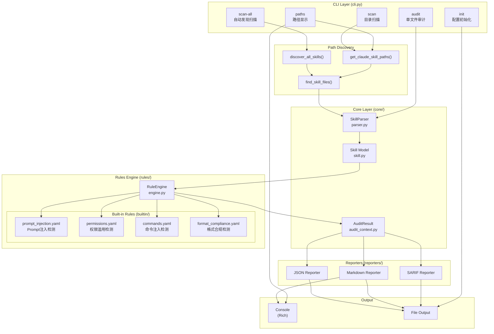
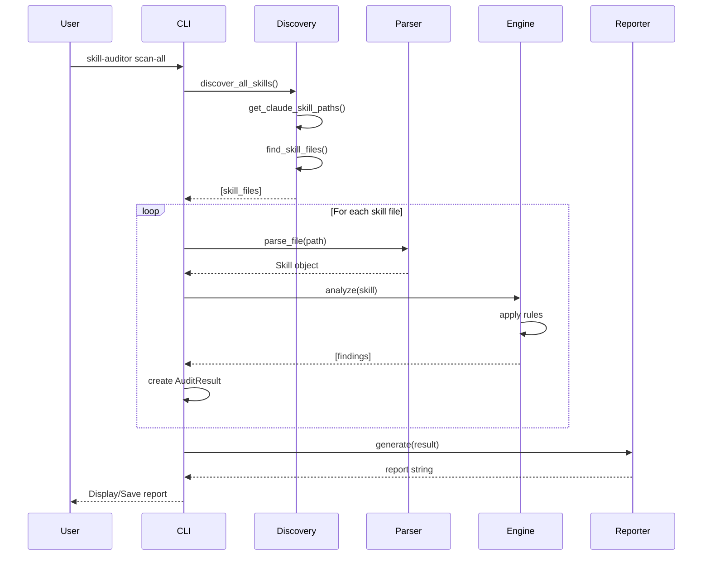
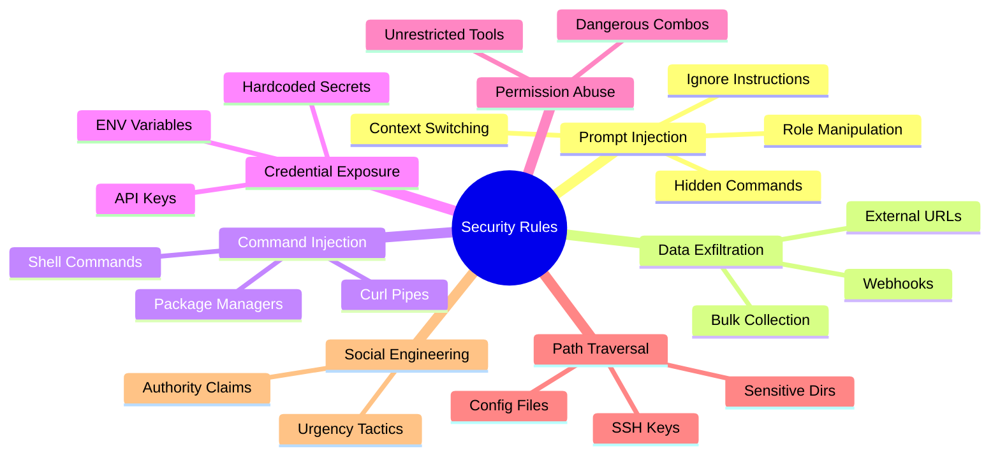

# Claude Skill Auditor - Architecture

## System Architecture Diagram



## Component Description

### CLI Layer (`cli.py`)
| Component | Description |
|-----------|-------------|
| `audit` | 审计单个 Skill 文件 |
| `scan` | 扫描指定目录或标准位置 |
| `scan-all` | 自动发现并扫描所有 Claude Skill |
| `paths` | 显示当前系统的 Skill 路径 |
| `init` | 创建配置文件 |

### Core Layer (`core/`)
| Component | File | Description |
|-----------|------|-------------|
| `SkillParser` | `parser.py` | 解析 YAML frontmatter + Markdown |
| `Skill` | `skill.py` | Skill 数据模型 |
| `AuditResult` | `audit_context.py` | 审计结果和风险评分 |

### Rules Engine (`rules/`)
| Component | Description |
|-----------|-------------|
| `RuleEngine` | 规则加载、条件注册、分析执行 |
| `prompt_injection.yaml` | 检测忽略指令、角色操纵等 |
| `permissions.yaml` | 检测权限滥用、危险工具 |
| `commands.yaml` | 检测危险命令、路径遍历 |
| `format_compliance.yaml` | 检测格式合规问题 |

### Reporters (`reporters/`)
| Format | Use Case |
|--------|----------|
| JSON | 自动化处理、API 集成 |
| Markdown | 人工阅读、文档 |
| SARIF | GitHub Code Scanning |

## Data Flow



## Directory Structure

```
claude-skill-auditor/
├── src/skill_auditor/
│   ├── __init__.py
│   ├── __main__.py
│   ├── cli.py                 # CLI 入口和命令定义
│   ├── core/
│   │   ├── __init__.py
│   │   ├── parser.py          # Skill 文件解析器
│   │   ├── skill.py           # Skill 数据模型
│   │   └── audit_context.py   # 审计结果模型
│   ├── rules/
│   │   ├── __init__.py
│   │   ├── engine.py          # 规则引擎
│   │   └── builtin/           # 内置规则
│   │       ├── prompt_injection.yaml
│   │       ├── permissions.yaml
│   │       ├── commands.yaml
│   │       └── format_compliance.yaml
│   └── reporters/
│       └── __init__.py        # 报告生成器
├── tests/                     # 测试套件
├── .github/workflows/         # CI/CD
├── README.md                  # English
├── README_zh.md               # 中文
└── pyproject.toml             # 包配置
```

## Security Rule Categories



## Risk Scoring

```
Risk Score = Σ (Severity Weight × Finding Count)

Severity Weights:
  CRITICAL = 25
  HIGH     = 15
  MEDIUM   = 8
  LOW      = 3
  INFO     = 1

Max Score = 100
```
