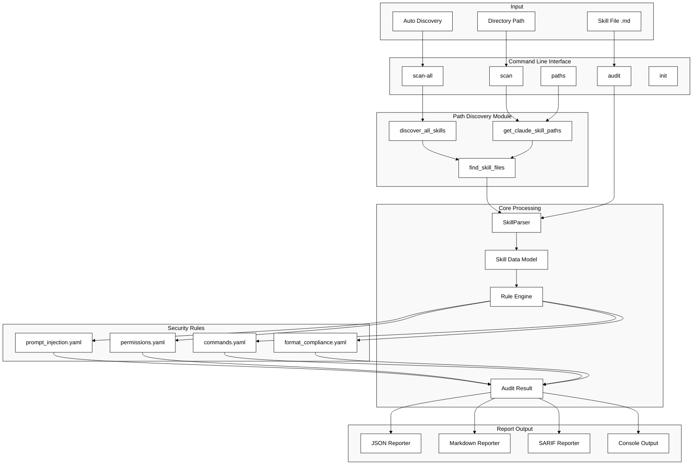
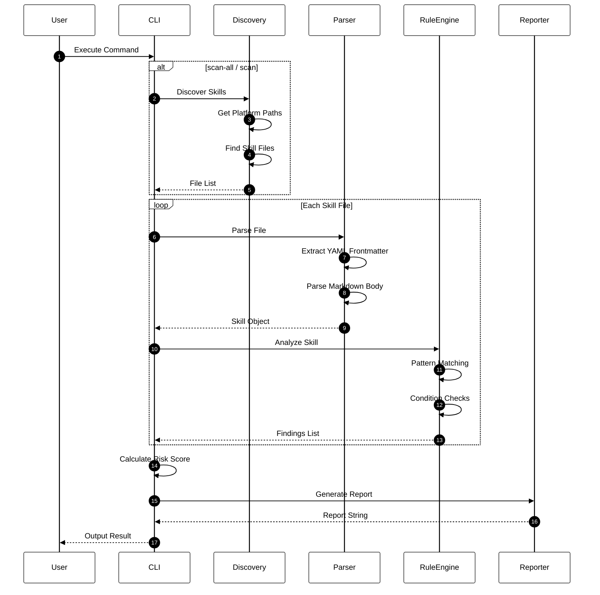
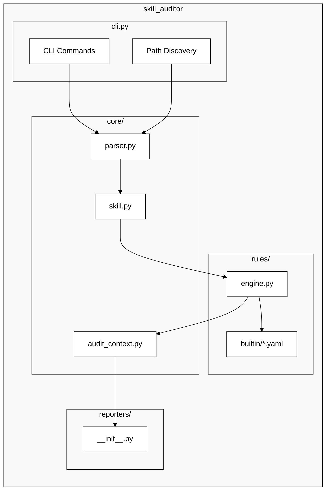

# Claude Skill Auditor - Architecture Overview

## System Architecture



---

## Data Flow



---

## Module Structure



---

## Security Rule Categories

```mermaid
%%{init: {'theme': 'base', 'themeVariables': { 'primaryColor': '#ffffff', 'primaryTextColor': '#000000', 'lineColor': '#000000', 'secondaryColor': '#f5f5f5', 'background': '#ffffff'}}}%%
flowchart TB
    subgraph Categories[Security Rule Categories]
        direction TB

        subgraph Critical[CRITICAL Severity]
            PI[Prompt Injection]
            DE[Data Exfiltration]
            CI[Command Injection]
            CE[Credential Exposure]
        end

        subgraph High[HIGH Severity]
            PA[Permission Abuse]
            PT[Path Traversal]
        end

        subgraph Medium[MEDIUM Severity]
            SE[Social Engineering]
            FC[Format Compliance]
        end
    end

    PI --> PI1[Ignore Instructions]
    PI --> PI2[Role Manipulation]
    PI --> PI3[Hidden Commands]

    DE --> DE1[External URLs]
    DE --> DE2[Webhooks]
    DE --> DE3[Bulk Collection]

    CI --> CI1[Shell Commands]
    CI --> CI2[Package Managers]
    CI --> CI3[Curl Pipes]

    CE --> CE1[ENV Variables]
    CE --> CE2[API Keys]
    CE --> CE3[Hardcoded Secrets]

    PA --> PA1[Unrestricted Tools]
    PA --> PA2[Dangerous Combinations]

    PT --> PT1[Sensitive Directories]
    PT --> PT2[Config Files]
    PT --> PT3[SSH Keys]

    SE --> SE1[Urgency Tactics]
    SE --> SE2[Authority Claims]
```



---

## Risk Scoring

```
Risk Score Calculation
======================

Formula: Risk Score = min(100, Σ(Weight × Count))

Severity Weights:
┌──────────────┬────────┐
│   Severity   │ Weight │
├──────────────┼────────┤
│   CRITICAL   │   40   │
│   HIGH       │   25   │
│   MEDIUM     │   10   │
│   LOW        │    3   │
│   INFO       │    0   │
└──────────────┴────────┘

Risk Levels:
┌──────────────┬─────────────┐
│    Level     │    Range    │
├──────────────┼─────────────┤
│  HIGH RISK   │  >= 70      │
│  MEDIUM RISK │  30 - 69    │
│  LOW RISK    │  < 30       │
└──────────────┴─────────────┘
```

---

## Directory Structure

```
claude-skill-auditor/
├── src/skill_auditor/
│   ├── __init__.py              # Package exports
│   ├── __main__.py              # Entry point
│   ├── cli.py                   # CLI commands + path discovery
│   │
│   ├── core/
│   │   ├── parser.py            # YAML + Markdown parser
│   │   ├── skill.py             # Skill data model
│   │   └── audit_context.py     # Audit result model
│   │
│   ├── rules/
│   │   ├── engine.py            # Rule engine
│   │   └── builtin/
│   │       ├── prompt_injection.yaml
│   │       ├── permissions.yaml
│   │       ├── commands.yaml
│   │       └── format_compliance.yaml
│   │
│   └── reporters/
│       └── __init__.py          # JSON, Markdown, SARIF
│
├── tests/                       # Test suite
├── docs/                        # Documentation
└── pyproject.toml               # Package configuration
```

---

## Platform Paths

```
┌──────────────┬─────────────────────────────────┬─────────────────────┐
│   Platform   │      Personal Skills Path       │  Project Skills     │
├──────────────┼─────────────────────────────────┼─────────────────────┤
│    macOS     │  ~/.claude/skills/              │  ./.claude/skills/  │
│    Linux     │  ~/.claude/skills/              │  ./.claude/skills/  │
│   Windows    │  %USERPROFILE%\.claude\skills\  │  .\.claude\skills\  │
└──────────────┴─────────────────────────────────┴─────────────────────┘
```
