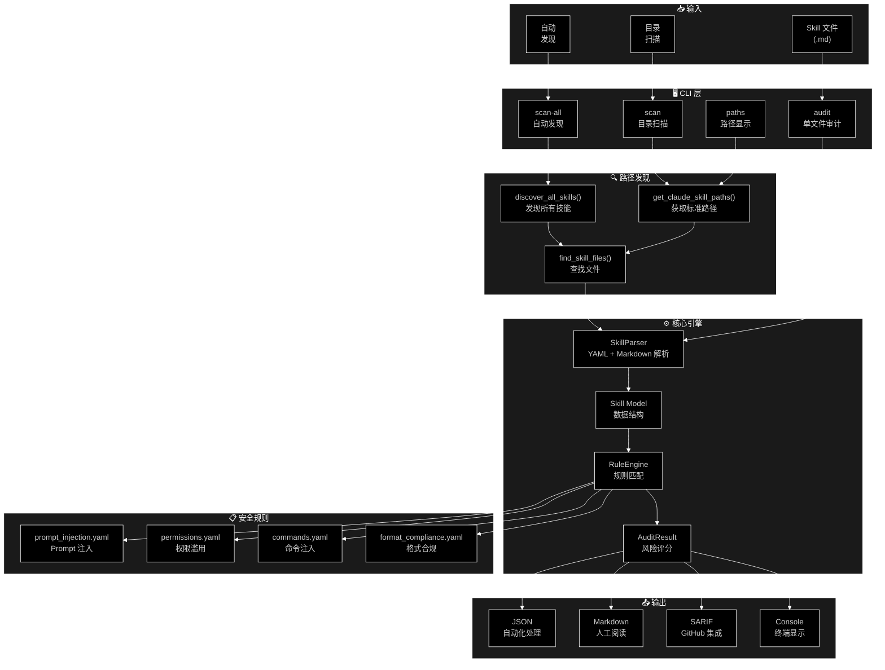
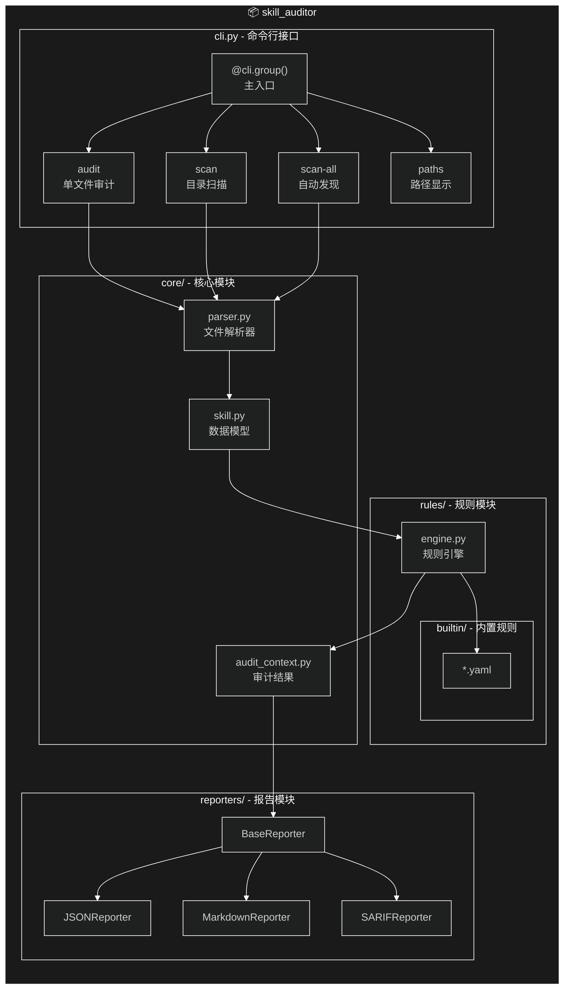
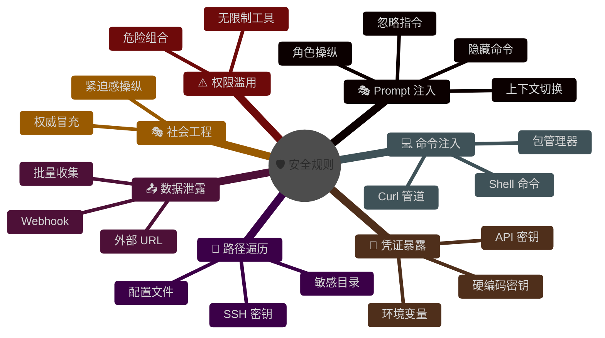
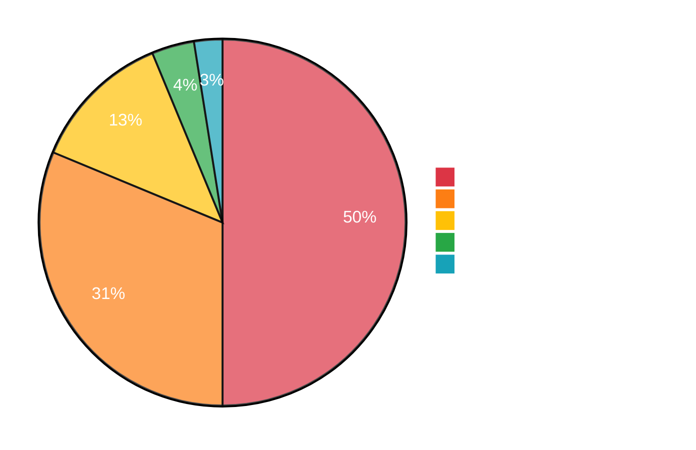
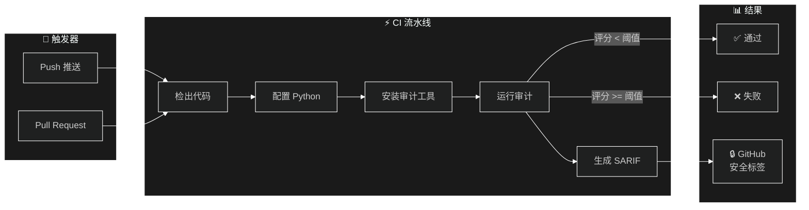

# Claude Skill Auditor - 架构文档

<p align="center">
  <a href="ARCHITECTURE.md">English</a> | <a href="ARCHITECTURE_zh.md">中文</a>
</p>

---

## 系统架构图



---

## 数据流

```mermaid
%%{init: {'theme': 'dark', 'themeVariables': { 'primaryColor': '#000000', 'primaryTextColor': '#ffffff', 'primaryBorderColor': '#ffffff', 'lineColor': '#ffffff', 'secondaryColor': '#1a1a1a', 'tertiaryColor': '#2a2a2a', 'background': '#000000', 'actorBkg': '#1a1a1a', 'actorBorder': '#ffffff', 'actorTextColor': '#ffffff', 'actorLineColor': '#ffffff', 'signalColor': '#ffffff', 'signalTextColor': '#ffffff', 'labelBoxBkgColor': '#000000', 'labelBoxBorderColor': '#ffffff', 'labelTextColor': '#ffffff', 'loopTextColor': '#ffffff', 'noteBkgColor': '#1a1a1a', 'noteTextColor': '#ffffff', 'noteBorderColor': '#ffffff', 'activationBkgColor': '#2a2a2a', 'activationBorderColor': '#ffffff', 'sequenceNumberColor': '#ffffff'}}}%%
sequenceDiagram
    autonumber
    participant U as 👤 用户
    participant C as 🖥️ CLI
    participant D as 🔍 路径发现
    participant P as 📄 解析器
    participant E as ⚙️ 规则引擎
    participant R as 📋 规则库
    participant O as 📤 报告生成

    U->>C: skill-auditor scan-all

    rect rgb(30, 30, 30)
        Note over C,D: 路径发现阶段
        C->>D: discover_all_skills()
        D->>D: get_claude_skill_paths()
        D->>D: find_skill_files()
        D-->>C: skill_files[]
    end

    rect rgb(30, 30, 30)
        Note over C,E: 分析阶段
        loop 遍历每个 Skill 文件
            C->>P: parse_file(path)
            P->>P: 提取 YAML frontmatter
            P->>P: 解析 Markdown body
            P-->>C: Skill 对象

            C->>E: analyze(skill)
            E->>R: 加载规则
            R-->>E: 规则模式
            E->>E: 模式匹配
            E->>E: 条件检查
            E-->>C: findings[]
        end
    end

    rect rgb(30, 30, 30)
        Note over C,O: 报告生成阶段
        C->>C: 创建 AuditResult
        C->>C: 计算风险评分
        C->>O: generate(result)
        O-->>C: 报告字符串
    end

    C-->>U: 显示/保存报告
```



---

## 组件架构



---

## 安全规则类别



---

## 风险评分模型



### 评分公式

```
┌─────────────────────────────────────────────────────────────┐
│                      风险评分计算                            │
├─────────────────────────────────────────────────────────────┤
│                                                             │
│   风险评分 = Σ (严重级别权重 × 发现数量)                      │
│                                                             │
│   ┌──────────────┬────────────┬─────────────────────────┐  │
│   │   严重级别   │    权重    │         影响            │  │
│   ├──────────────┼────────────┼─────────────────────────┤  │
│   │   严重       │     40     │  必须阻断安装            │  │
│   │   高危       │     25     │  强烈建议阻断            │  │
│   │   中危       │     10     │  需要人工审核            │  │
│   │   低危       │      3     │  信息提示                │  │
│   │   信息       │      0     │  无需操作                │  │
│   └──────────────┴────────────┴─────────────────────────┘  │
│                                                             │
│   最高评分: 100                                             │
│                                                             │
│   风险等级:                                                 │
│   ┌─────────────────────────────────────────────────────┐  │
│   │  🔴 高风险     │  评分 >= 70                        │  │
│   │  🟡 中风险     │  评分 30-69                        │  │
│   │  🟢 低风险     │  评分 < 30                         │  │
│   └─────────────────────────────────────────────────────┘  │
│                                                             │
└─────────────────────────────────────────────────────────────┘
```

---

## 目录结构

```
claude-skill-auditor/
├── src/skill_auditor/
│   ├── __init__.py           # 包导出
│   ├── __main__.py           # 入口点
│   ├── cli.py                # CLI 命令和路径发现
│   ├── core/
│   │   ├── __init__.py
│   │   ├── parser.py         # YAML + Markdown 解析器
│   │   ├── skill.py          # Skill 数据模型
│   │   └── audit_context.py  # 审计结果和发现
│   ├── rules/
│   │   ├── __init__.py
│   │   ├── engine.py         # 规则引擎和条件
│   │   └── builtin/          # 内置 YAML 规则
│   │       ├── prompt_injection.yaml
│   │       ├── permissions.yaml
│   │       ├── commands.yaml
│   │       └── format_compliance.yaml
│   └── reporters/
│       └── __init__.py       # JSON, Markdown, SARIF
├── tests/                    # 测试套件
├── docs/                     # 文档
├── .github/workflows/        # CI/CD
├── README.md                 # 英文文档
├── README_zh.md              # 中文文档
└── pyproject.toml            # 包配置
```

---

## 平台支持

| 平台 | 个人技能路径 | 项目技能路径 |
|------|-------------|-------------|
| **macOS** | `~/.claude/skills/` | `./.claude/skills/` |
| **Linux** | `~/.claude/skills/` | `./.claude/skills/` |
| **Windows** | `%USERPROFILE%\.claude\skills\` | `.\.claude\skills\` |

---

## CI/CD 集成


